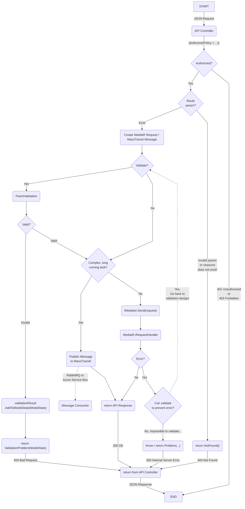

# Accelist Web API Standard

ASP.NET Core project templates designed with Clean Architecture, featuring CQRS Pattern, RabbitMQ Messaging, and OpenID Connect Server with ASP.NET Core Identity.

## Getting Started

### Add NuGet Source

```ps1
dotnet nuget add source `
    --username johnsmith `
    --password GITHUB_PERSONAL_ACCESS_TOKEN `
    --store-password-in-clear-text `
    --name accelist `
    "https://nuget.pkg.github.com/accelist/index.json"
```

> [GitHub Packages only supports authentication using a personal access token (classic)](https://docs.github.com/en/authentication/keeping-your-account-and-data-secure/creating-a-personal-access-token)

> Read more: https://docs.github.com/en/packages/working-with-a-github-packages-registry/working-with-the-nuget-registry

### Install Template

```
dotnet new --install Accelist.WebApiStandard.Templates
```

This message should be displayed in the console:

```
The following template packages will be installed:
   Accelist.WebApiStandard.Templates

Success: Accelist.WebApiStandard.Templates::0.1.1 installed the following templates:
Template Name                      Short Name         Language  Tags
---------------------------------  -----------------  --------  --------------------
Accelist Standard Web Application  accelist-standard  [C#]      ASP.NET Core/Web API
```

> Update installed template using this command: https://learn.microsoft.com/en-us/dotnet/core/tools/dotnet-new-update

### Create New Project

Go to an empty new project folder

```
cd D:\VS\Accelist.HelloProject
dotnet new accelist-standard -n Accelist.HelloProject
```

## Accelist Next.js Starter Jump Start

When using https://github.com/accelist/nextjs-starter set `.env.development` or `.env.local` to these values to integrate with this template:

```
BACKEND_API_HOST=http://localhost:5052
OIDC_ISSUER=http://localhost:5051
OIDC_CLIENT_ID=cms
OIDC_SCOPE=openid profile email roles offline_access api
``` 

## About RabbitMQ...

The default MassTransit integration in the Web API project is enabled against RabbitMQ. If this is not desirable, simply change to use either in-memory transport (single node only, development only) or against cloud solutions such as Azure Service Bus.

> Azure Service Bus integration for MassTransit: https://masstransit-project.com/usage/transports/azure-sb.html

In the highly unlikely scenario where out-of-process messaging is not needed, MassTransit can be removed from the service collection altogether.

## About Kafka Projects...

They are actually not needed to run the web apps and can be safely deleted from your solution if you do not need Apache Kafka integrations. (Simply delete `KafkaServices`, `KafkaWorker`, and `DemoKafkaProducer` projects without any side effects)

## MARVEL Software Development Pattern


### Developer Adventure: Developing Web API



### Clean Architecture: The Pyramid


**The order of development should be done from top to bottom:**

- **Entities maps directly to the database objects and are defined according to business / user needs.** The Functional Specification Document (FSD) / UI Design designed by the project Analyst MUST ALWAYS be referenced when developing the Entities to avoid missing data. Changes to the entities should be EXTREMELY RARE as it forms the foundation of the system.

- **Contracts are collection of classes used in MediatR Request + Response pattern or RabbitMQ Messages. Contracts do not have logic. Contracts are equivalent to Input-Output interface of a system.** MediatR Request is similar to a method signature of a normal C# class, except that it is not a method, but only a simple class. MediatR Request can be said as an in-process message, unlike RabbitMQ which is an out-of-process messaging system. Changes to the contracts should be RARE as it defines the logic interface of the system.

- **"The Engine", "The Core", or "The Nucleus" project consists of the actual implementation of the app logic. This is where the "Process" part is developed against the Input-Output declared in the Contracts project, forming a complete Input-Process-Output sequence of the system.** "The Engine" project usually contains the following processes: Request Handlers for MediatR Request-Response, RabbitMQ Message Consumers (using MassTransit), Validators for Request or Message (using FluentValidation). Other reusable services and extension methods may also be placed in this project. In essence, the logic of the whole app can be developed in this project without touching any Web API. Changes to "The Engine" should be COMMON because it defines the logic of the system itself.

- **"The App" is where "The Engine" is mapped against the interface of the system, which is usually JSON Web API.** "The App" is the project that is actually run-able and interactive to the developer. A developer can run "The App" and provide it with inputs. The inputs will then be mapped against an API Model and routed into an API Controller. The API Controller is responsible for authorization, validation, constructing a MediatR Request or a RabbitMQ Message, and sending / publishing them correctly. "The App" will then return the correct response which is needed by the UI layer. Changes to Web API should be COMMON because it follows UI requirement but already-published APIs MUST NOT change to maintain backward-compatibility to existing Front-End Apps.

- **"The UI" is the Front-End Web App developed with Next.js or Mobile Apps which interacts with the Web API previously developed.** "The UI" is usually developed according to the FSD / UI Design. Therefore, the Web API must comply to the requirements of "The UI". Changes to "The UI" should be FREQUENT because UI requirement follows evolving business requirements or Change Requests (CR).

> This Clean Architecture is compatible with the Domain-Driven-Development (DDD), Command and Query Responsibility Segregation (CQRS) for microservice by Microsoft: https://learn.microsoft.com/en-us/dotnet/architecture/microservices/microservice-ddd-cqrs-patterns/microservice-application-layer-implementation-web-api

#### Web API CQRS Pattern with Mediator (In-Process Messaging)


#### Web API CQRS Pattern with Message Bus (Out-of-Process Messaging)


