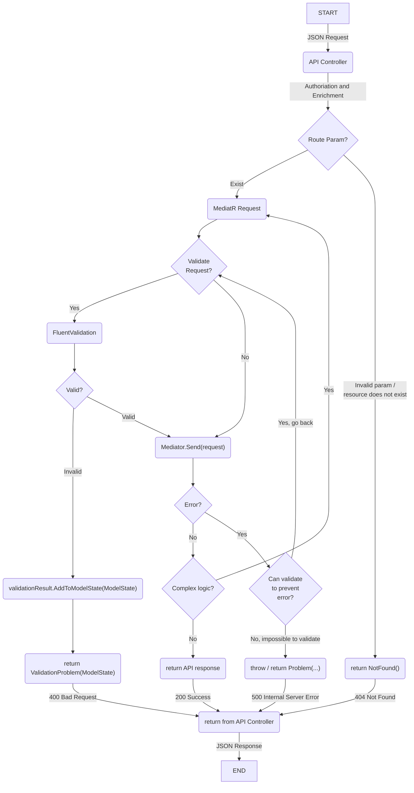

# Accelist Web API Standard

ASP.NET Core project templates designed with Clean Architecture, featuring CQRS Pattern, RabbitMQ Messaging, and OpenID Connect Server with ASP.NET Core Identity.

## Getting Started

### Add NuGet Source

```ps1
dotnet nuget add source `
    --username johnsmith `
    --password GITHUB_PERSONAL_ACCESS_TOKEN `
    --store-password-in-clear-text `
    --name accelist `
    "https://nuget.pkg.github.com/accelist/index.json"
```

> [GitHub Packages only supports authentication using a personal access token (classic)](https://docs.github.com/en/authentication/keeping-your-account-and-data-secure/creating-a-personal-access-token)

> Read more: https://docs.github.com/en/packages/working-with-a-github-packages-registry/working-with-the-nuget-registry

### Install Template

```
dotnet new --install Accelist.WebApiStandard.Templates
```

This message should be displayed in the console:

```
The following template packages will be installed:
   Accelist.WebApiStandard.Templates

Success: Accelist.WebApiStandard.Templates::0.1.1 installed the following templates:
Template Name                      Short Name         Language  Tags
---------------------------------  -----------------  --------  --------------------
Accelist Standard Web Application  accelist-standard  [C#]      ASP.NET Core/Web API
```

> Update installed template using this command: https://learn.microsoft.com/en-us/dotnet/core/tools/dotnet-new-update

### Create New Project

Go to an empty new project folder

```
cd D:\VS\Accelist.HelloProject
dotnet new accelist-standard -n Accelist.HelloProject
```

## Accelist Next.js Starter Jump Start

When using https://github.com/accelist/nextjs-starter set `.env.development` or `.env.local` to these values to integrate with this template:

```
BACKEND_API_HOST=http://localhost:5052
OIDC_ISSUER=http://localhost:5051
OIDC_CLIENT_ID=cms
OIDC_SCOPE=openid profile email roles offline_access api
``` 

## MARVEL Software Development Pattern

